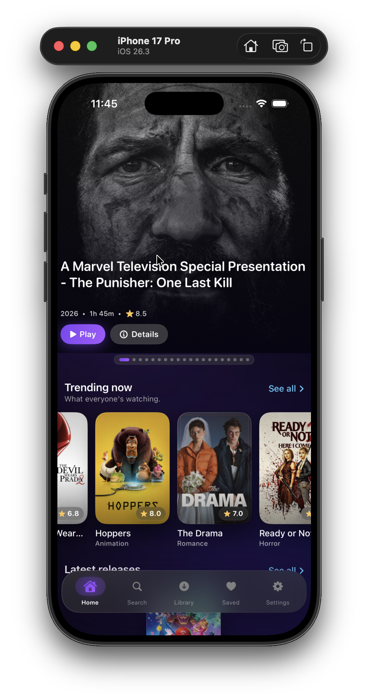
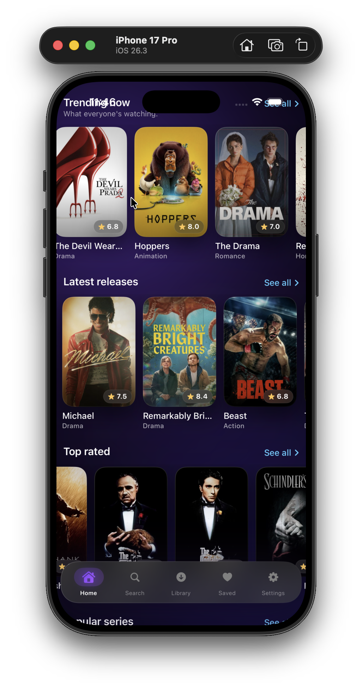
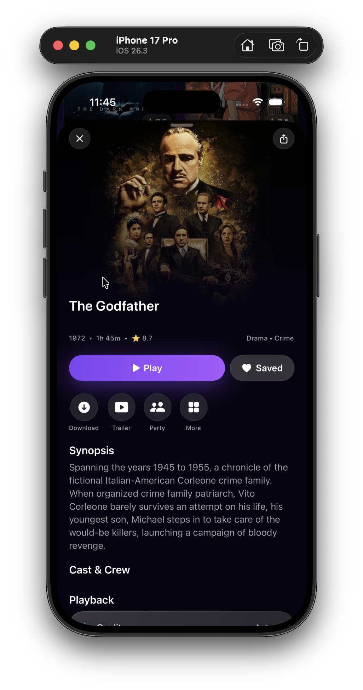
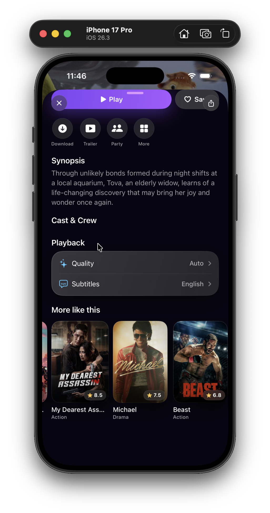
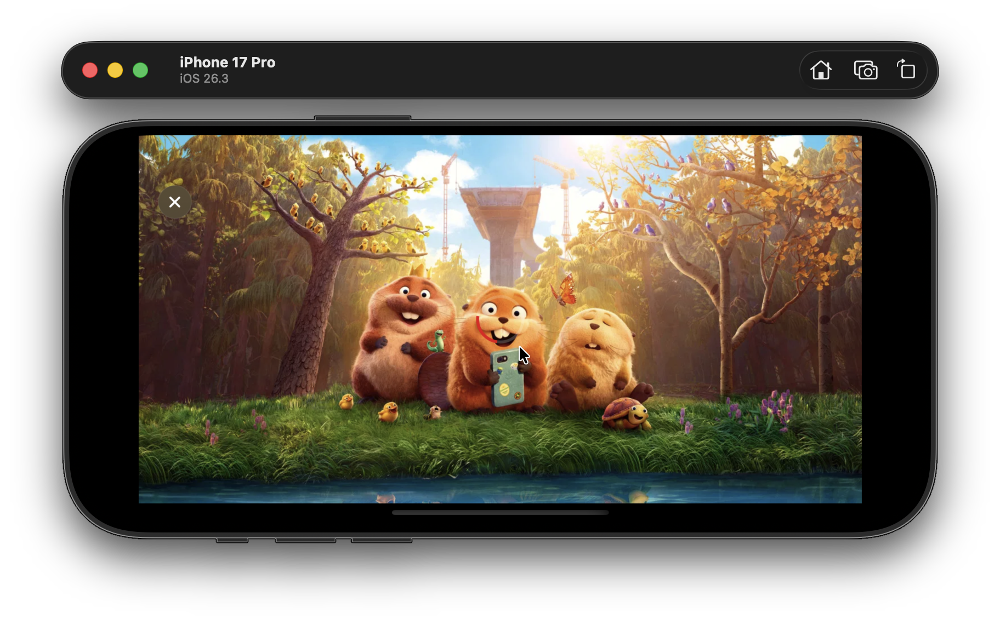
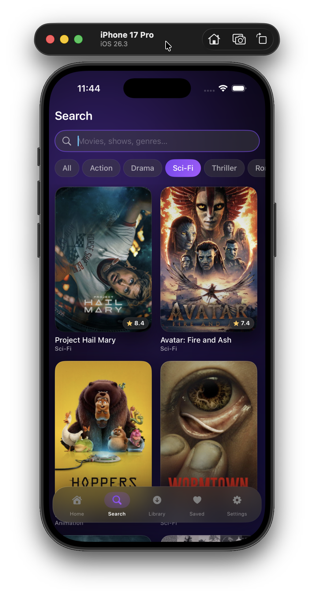
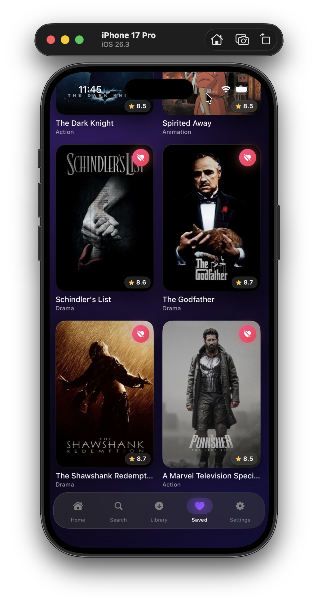
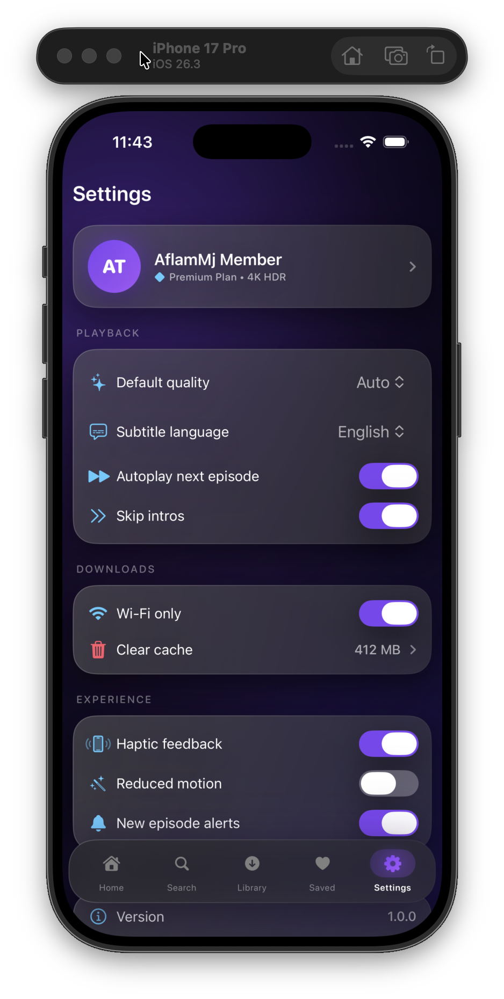

# AflamMj — أفلام MJ

A modern iOS streaming app built with SwiftUI, powered by the TMDB API.

---

## Screenshots

**Home** &nbsp;&nbsp;&nbsp;&nbsp;&nbsp;&nbsp;&nbsp;&nbsp;&nbsp;&nbsp;&nbsp;&nbsp;&nbsp;&nbsp;&nbsp;&nbsp;&nbsp;&nbsp;&nbsp;&nbsp;&nbsp;&nbsp;&nbsp;&nbsp;&nbsp; **Home (Scroll)** &nbsp;&nbsp;&nbsp;&nbsp;&nbsp;&nbsp;&nbsp;&nbsp;&nbsp;&nbsp;&nbsp;&nbsp;&nbsp;&nbsp;&nbsp;&nbsp;&nbsp; **Details** &nbsp;&nbsp;&nbsp;&nbsp;&nbsp;&nbsp;&nbsp;&nbsp;&nbsp;&nbsp;&nbsp;&nbsp;&nbsp;&nbsp;&nbsp;&nbsp;&nbsp;&nbsp;&nbsp;&nbsp;&nbsp;&nbsp;&nbsp;&nbsp; **Details (More)**

   

---

**Player** &nbsp;&nbsp;&nbsp;&nbsp;&nbsp;&nbsp;&nbsp;&nbsp;&nbsp;&nbsp;&nbsp;&nbsp;&nbsp;&nbsp;&nbsp;&nbsp;&nbsp;&nbsp;&nbsp;&nbsp;&nbsp;&nbsp;&nbsp;&nbsp;&nbsp;&nbsp;&nbsp;&nbsp; **Search** &nbsp;&nbsp;&nbsp;&nbsp;&nbsp;&nbsp;&nbsp;&nbsp;&nbsp;&nbsp;&nbsp;&nbsp;&nbsp;&nbsp;&nbsp;&nbsp;&nbsp;&nbsp;&nbsp;&nbsp;&nbsp;&nbsp;&nbsp;&nbsp;&nbsp;&nbsp;&nbsp; **Saved** &nbsp;&nbsp;&nbsp;&nbsp;&nbsp;&nbsp;&nbsp;&nbsp;&nbsp;&nbsp;&nbsp;&nbsp;&nbsp;&nbsp;&nbsp;&nbsp;&nbsp;&nbsp;&nbsp;&nbsp;&nbsp;&nbsp;&nbsp;&nbsp;&nbsp;&nbsp;&nbsp; **Settings**

   

---

## Features

- Browse trending, latest, and top-rated movies and TV series
- Full-screen edge-to-edge hero carousel on the home screen
- Movie detail pages with backdrop, synopsis, cast, and related titles
- Built-in web player (WKWebView) with landscape support
- Save favorites with persistent storage via SwiftData
- Search movies and TV shows
- Dark mode glassmorphism UI

## Tech Stack

- **SwiftUI** — UI framework (iOS 17+)
- **SwiftData** — persistent favorites storage
- **WKWebView** — in-app video player
- **TMDB API** — movie and TV metadata
- **streamimdb.ru** — stream embed URLs

## Requirements

- iOS 17+
- Xcode 15+
- TMDB API key (set in `Networking/TMDBClient.swift`)

## Project Structure

```
Aetheria/
├── App/                    Entry point, RootView, FloatingTabBar
├── Core/                   Haptics, View extensions
├── Data/
│   ├── Models/             Movie, Genre, TMDBResponse, SwiftData entities
│   └── Repositories/       ContentRepository + TMDB implementation
├── DesignSystem/
│   ├── Components/         GlassCard, PosterCard, PrimaryButton, ShimmerView…
│   ├── Modifiers/          Glow, ParallaxTilt, PressableScale
│   └── Theme/              Colors, Gradients, Typography, Spacing
├── Features/
│   ├── Home/               Hero carousel, content rows
│   ├── Details/            Movie detail sheet with cast & related titles
│   ├── Search/             Live search with genre filters
│   ├── Favorites/          Saved movies, sort & filter
│   ├── Downloads/          Download manager UI
│   └── Settings/           App settings
├── Networking/             APIClient, Endpoints, TMDBClient
└── Player/                 WebPlayerView (WKWebView-based)
```

## Getting Started

1. Clone the repo
2. Open `AflamMj.xcodeproj` in Xcode
3. Add your TMDB API key in `Networking/TMDBClient.swift`
4. Build and run on a simulator or device (iOS 17+)
